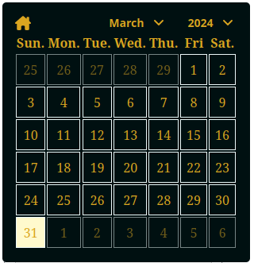

# em-react-calendar : A React component Calendar

## Runtime / package manager

`nodejs` : `v20.11.1` - LTS

## Installation

`npm install "em-react-calendar"`

npm link: 

## Usage

The component has three props:

- `inputId`: the id of the input used to display selected date
- `selectedDate`: A Date object, `new Date()` is relevant
- `onDateSelect` A callback function to handle date selection